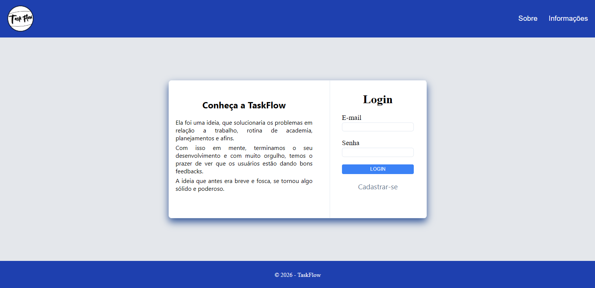
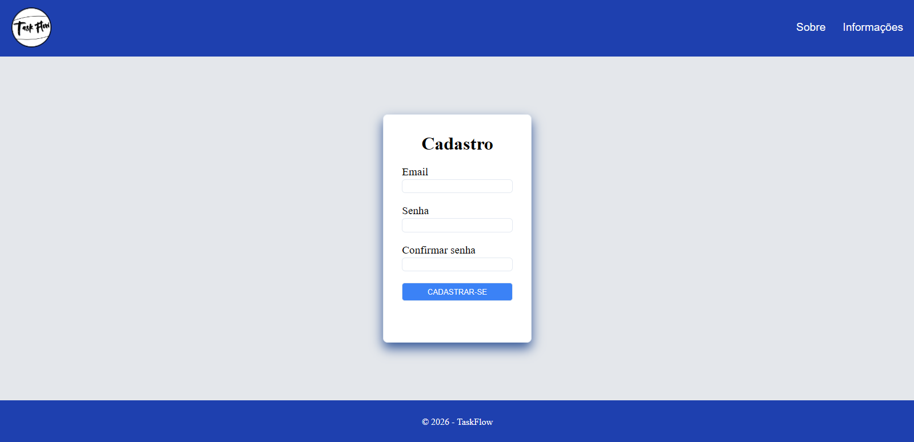
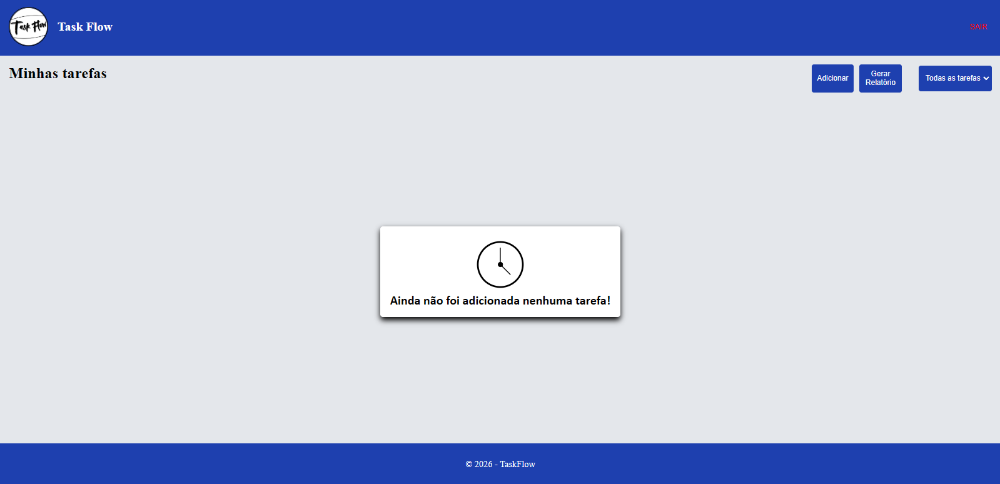
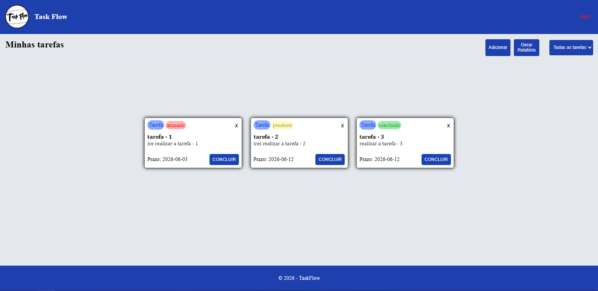

# TaskFlow

TaskFlow é uma aplicação web simples para organizar tarefas do dia a dia. O projeto permite cadastrar usuários, fazer login, criar tarefas, filtrar por status, concluir, excluir e gerar um relatório em arquivo de texto.

O foco da aplicação é deixar o controle de tarefas mais direto, usando apenas HTML, CSS e JavaScript, com os dados salvos no `localStorage` do navegador.

## Login


## Cadastro



## Dashboard - sem tarefas



## Dashboard - com tarefas



## Funcionalidades

- Cadastro de novos usuários.
- Login com validação de e-mail e senha.
- Controle de usuário ativo.
- Criação de tarefas com nome, descrição e prazo.
- Exibição das tarefas em cards.
- Filtro por status:
  - Todas as tarefas
  - Pendentes
  - Concluídas
  - Atrasadas
- Marcação de tarefas como concluídas.
- Identificação de tarefas atrasadas.
- Exclusão de tarefas.
- Geração de relatório em `.txt`.
- Limitação do prazo para impedir datas anteriores ao dia atual.

## Tecnologias Utilizadas

- HTML5
- CSS3
- JavaScript
- LocalStorage

## Como Executar

Como o projeto usa módulos JavaScript (`type="module"`), o ideal é abrir usando a extensão **Live Server** no VS Code.

1. Abra a pasta do projeto no VS Code.
2. Clique com o botão direito em `front-end/pages/login.html`.
3. Selecione `Open with Live Server`.

## Estrutura do Projeto

```text
TaskFlow/
├── assets/
│   └── img/
│       └── Logo-TaskFlow.png
│
├── front-end/
│   ├── css/
│   │   ├── global/
│   │   ├── UI-cadastro-Login/
│   │   └── Ui-Index/
│   │
│   └── pages/
│       ├── cadastro.html
│       ├── index.html
│       └── login.html
│
├── scripts/
│   ├── cadastro/
│   ├── card/
│   ├── login/
│   ├── modal/
│   ├── suporte/
│   ├── relatorio.js
│   └── sair.js
│
└── README.md
```

## Fluxo da Aplicação

O usuário começa na tela de login. Caso ainda não tenha conta, pode acessar a página de cadastro e criar um usuário novo.

Depois do login, o usuário é levado para o dashboard principal, onde pode adicionar tarefas, visualizar os cards, filtrar por status, concluir tarefas, excluir cards e gerar um relatório com o resumo das tarefas cadastradas.

Os dados ficam salvos no navegador através do `localStorage`, então cada navegador mantém suas próprias informações.
## Estrutura dos Dados

## Estrutura dos Dados

Exemplo de armazenamento dos Usuários:


```json
{
  email:"usuario@gmail.com",
  senha: "usuario",
  id: 1,
  ativo: true
}
```
Exemplo de armazenamento dos cards:

```json
{
  "id": 1,
  "nome": "Usuário",
  "ativo": true,
  "card": [
    {
      "idCard": 1,
      "nome": "Estudar JavaScript",
      "status": "pendente",
      "data": "2026-06-11"
    }
  ]
}
```
## Principais Arquivos

- `front-end/pages/login.html`: página de login.
- `front-end/pages/cadastro.html`: página de cadastro.
- `front-end/pages/index.html`: página principal das tarefas.
- `scripts/login/login.js`: controla o login do usuário.
- `scripts/cadastro/cadastro.js`: controla o cadastro de novos usuários.
- `scripts/card/adicionar-card.js`: cria novas tarefas.
- `scripts/card/carregar-cards.js`: carrega as tarefas salvas.
- `scripts/card/filtro.js`: aplica os filtros de status.
- `scripts/relatorio.js`: gera o relatório em arquivo de texto.

## Status do Projeto

Projeto concluído para fins acadêmicos e aprendizado de desenvolvimento web com HTML, CSS e JavaScript.

## Aprendizados

Durante o desenvolvimento deste projeto foram praticados conceitos como:

- Manipulação do DOM
- Eventos em JavaScript
- Módulos ES6
- Armazenamento com LocalStorage
- Validação de formulários
- Organização de código em múltiplos arquivos
- Manipulação de datas
- Filtragem dinâmica de dados

## Autor

Luis Fernando Prates Santana
RA: 2026108210